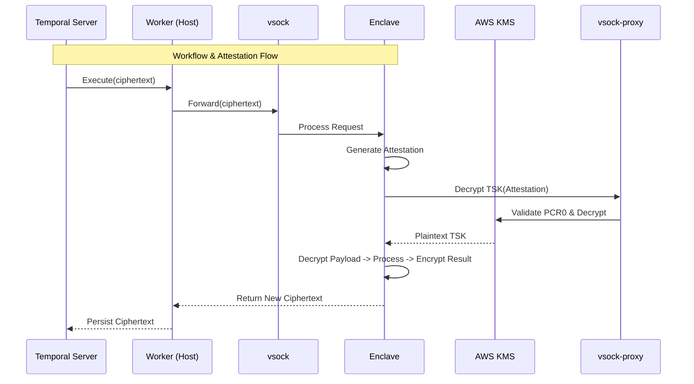

# Confidential Multi-Agent Workflow

## Project Overview

This Proof of Concept (POC) implements a **Secure State Transfer Protocol** designed for distributed agentic systems. The objective is to demonstrate the secure exchange of sensitive intermediate state (Context) between two distinct agents executing within isolated Trusted Execution Environments (TEEs) using **cryptographic encapsulation**.

 This architecture addresses the security risks inherent in standard orchestration frameworks where workflow state is typically persisted in plaintext. By integrating AWS Nitro Enclaves with Temporal, this solution ensures that the orchestration engine and the host infrastructure interact exclusively with encrypted data (ciphertext), while plaintext processing is confined strictly to the hardware-protected memory of the enclave.

## Confidential & Durable Shared State

- Secure, attested data exchange between isolated environments using hardware-accelerated cryptographic encapsulation.
- Obfuscated state interactions designed to prevent sensitive data inference from timing or sequence observation.
- Decentralized shared protocol allowing autonomous agents to securely discover and process context concurrently.
- Hardware-enforced isolation ensuring data remains invisible to the host infrastructure during active processing.

## Architecture



## Getting Started

### Quick Start

```bash
# Clone the repository
git clone https://github.com/0xktn/confidential-multi-agent-workflow.git
cd confidential-multi-agent-workflow

# Automated Setup (Creates EC2, KMS & Builds Enclave)
./scripts/setup.sh
```

### Run a Workflow
 
 Trigger a confidential workflow execution to see the state transfer in action:
 
 ```bash
 # On the EC2 instance
 ./scripts/trigger.sh
 ```
 
 ### Verification
 
 Verify the system is actively securing data via hardware attestation:
 
 ```bash
 ./scripts/trigger.sh --verify
 ```

**Expected Output**:
```
✅ SYSTEM VERIFIED
   Proof: Found 'Enclave configured successfully' in worker logs
   Conclusion: System is healthy and securely decrypting keys.
```

## References

- [System Reference & Troubleshooting](docs/REFERENCE.md)

- [Enclave Development](docs/ENCLAVE_DEVELOPMENT.md)

## License

This project is licensed under the MIT License - see the [LICENSE](LICENSE) file for details.