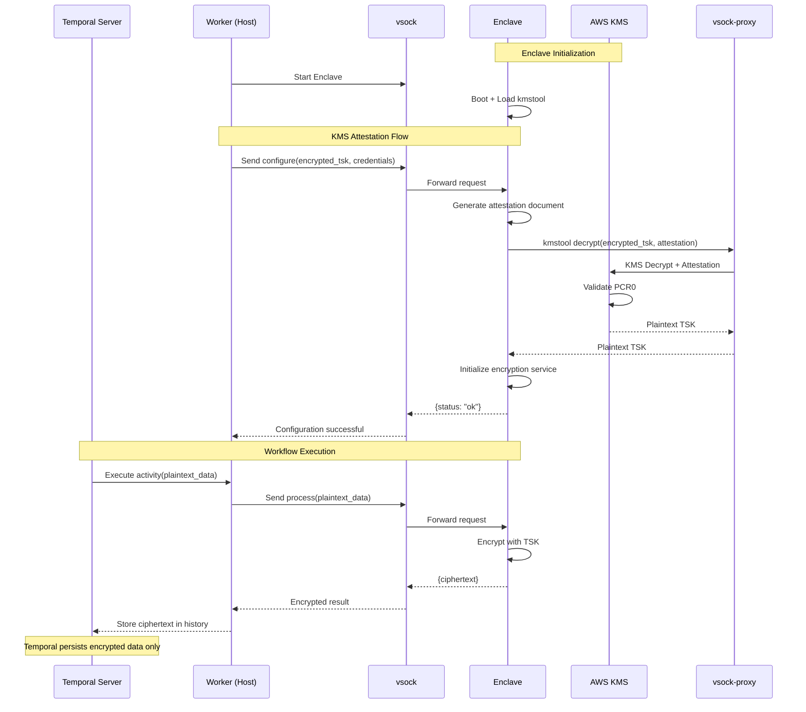

# Confidential Multi-Agent Workflow

## Project Overview

This Proof of Concept (POC) implements a Secure State Transfer Protocol designed for distributed agentic systems. The objective is to demonstrate the secure exchange of sensitive intermediate state (Context) between two distinct agents executing within isolated Trusted Execution Environments (TEEs).

This architecture addresses the security risks inherent in standard orchestration frameworks where workflow state is typically persisted in plaintext. By integrating AWS Nitro Enclaves with Temporal, this solution ensures that the orchestration engine and the host infrastructure interact exclusively with encrypted data (ciphertext), while plaintext processing is confined strictly to the hardware-protected memory of the enclave.

## Core Objectives

1. **Confidentiality**: Verify that agent state remains encrypted at rest within the orchestration history and in transit through the host OS.
2. **Verifiability**: Implement cryptographic attestation to strictly bind decryption key access to specific, immutable software identities (PCR measurements).
3. **Durability**: Leverage Temporal for deterministic workflow execution without compromising data privacy.

## Architecture and Design

This POC implements a "Full Confidential Execution" model. The architecture divides the system into Untrusted (Host/Orchestrator) and Trusted (Enclave) domains.

### Component Breakdown

| Component | Technology | Role |
|-----------|------------|------|
| Trusted Compute | AWS Nitro Enclaves | Isolated execution environment for Agent logic, responsible for decryption, processing, and encryption. |
| Orchestrator | Temporal | Manages workflow state transitions and persists encrypted blobs (Ciphertext). |
| Key Management | AWS KMS | Stores the Trusted Session Key (TSK). Releases the key only upon validating the Enclave's attestation document. |
| Host Interface | vsock | Facilitates local socket communication between the untrusted Parent Instance and the Trusted Enclave. |
| Serialization | Protocol Buffers | Provides schema-bound binary serialization to ensure type safety and prevent deserialization attacks at the TEE boundary. |

### Architecture Diagram



### Data Flow: The Secure State Loop

The workflow executes a sequential transfer of state between Agent A and Agent B following this protocol:

1. **Bootstrapping (Agent A)**: The enclave initializes and requests the Trusted Session Key (TSK) from AWS KMS. KMS validates the enclave's PCR0 (software identity) before releasing the key.
2. **Encryption (Agent A)**: Agent A generates initial state, serializes it via Protobuf, and encrypts it using the TSK. The resulting ciphertext is returned to the host.
3. **Persistence (Host)**: The Temporal Worker receives the ciphertext via vsock and returns it to the Temporal Server. The server persists this blob in the Event History.
4. **Handoff (Agent B)**: Temporal triggers the next workflow step. The host passes the ciphertext from history to a new enclave instance (Agent B).
5. **Decryption (Agent B)**: Agent B performs independent attestation to retrieve the TSK, decrypts the input ciphertext, processes the data, and returns a new encrypted result.

## Prerequisites

- **Infrastructure**: AWS EC2 Instance (Parent) with Nitro Enclave support (verified on `c6a.xlarge`, `m5.xlarge`).
- **Operating System**: Amazon Linux 2023 (Verified). Ubuntu/AL2 are NOT supported.
- **Enclave Resources**: Minimum 2048 MB RAM and 2 vCPUs.
- **Orchestration Server**: Access to a Temporal Server (Temporal Cloud or Self-Hosted on Host).
- **Language Runtime**: Python 3.9+ (Host), Python 3.11 (Enclave Base).

## Getting Started

### Prerequisites

- **AWS CLI** configured with credentials (`aws configure`)
- **SQLite** (pre-installed on macOS, `apt install sqlite3` on Linux)
- Required AWS permissions: `AmazonEC2FullAccess`, `AWSKeyManagementServicePowerUser`, `IAMFullAccess`, `AmazonSSMFullAccess`

### Quick Start

```bash
# Clone the repository
git clone https://github.com/0xktn/confidential-multi-agent-workflow.git
cd confidential-multi-agent-workflow

# Set a passphrase for local state encryption
echo "your-passphrase" > INSECURE_PASSWORD_TEXT

# Run the automated setup (takes ~10 minutes)
./scripts/setup.sh
```

The setup script automatically:
1. Creates an EC2 instance with Nitro Enclave support
2. Configures KMS key with attestation policy  
3. Starts Temporal server on EC2
4. Builds and runs the enclave
5. Starts the host worker

### After Setup

```bash
# Check status
./scripts/setup.sh --remote-status

# SSH into the instance
ssh -i ~/.ssh/nitro-enclave-key.pem ec2-user@<instance-ip>

# Cleanup all resources
./scripts/setup.sh --clean
```

## KMS Attestation Setup

### Understanding PCR0

PCR0 (Platform Configuration Register 0) is a cryptographic hash of the enclave image file (EIF). AWS KMS uses this measurement to verify the enclave's identity before releasing decryption keys.

**Key Concept**: Every time you rebuild the enclave image, the PCR0 value changes. You must update the KMS key policy with the new PCR0 to maintain access.

### Initial Setup

The automated setup script handles KMS configuration, but if you need to manually update the policy:

```bash
# 1. Build the enclave image
cd enclave
docker build -t confidential-enclave .
nitro-cli build-enclave --docker-uri confidential-enclave:latest --output-file ../build/enclave.eif

# 2. Extract PCR0 from build output
# Look for: "PCR0": "ff332b26..."

# 3. Update KMS policy with new PCR0
# Edit scripts/update_policy_local.py with the new PCR0 value
python3 scripts/update_policy_local.py

# 4. Generate new encrypted TSK
# The script automatically creates encrypted-tsk.b64
```

### Current PCR0

```
ff332b261c7e90783f1782aad362dd1c9f0cd75f95687f78816933145c62a78c18b8fbe644adadd116a2d4305b888994
```

### Testing KMS Attestation

Verify the end-to-end KMS attestation flow:

```bash
# On the EC2 instance
cd /home/ec2-user/confidential-multi-agent-workflow

# Ensure vsock-proxy is running
vsock-proxy 8000 kms.ap-southeast-1.amazonaws.com 443 &

# Ensure enclave is running
nitro-cli describe-enclaves

# Run the test
python3 tests/test_kms_attestation.py
```

**Expected Output**:
```
✅ Configuration successful! TSK decrypted via kmstool with attestation!
✅ Processing successful!
🎉 END-TO-END KMS ATTESTATION TEST PASSED!
```

## Verification Procedure

To validate the success of the POC, confirm the following metrics:

1. **Confidentiality Verification**:
   - Access the Temporal Web UI.
   - Inspect the "Input" and "Result" payloads in the Event History.
   - Requirement: Data must appear as opaque binary/hex strings (ciphertext). No plaintext JSON should be visible.
2. **Attestation Verification**:
   - Query AWS CloudTrail logs for kms:Decrypt events.
   - Requirement: The event context must include a valid attestationDocument field, confirming the key was released only after hardware verification.
3. **Integrity Verification**:
   - Decrypt the final output of the workflow locally (using a debugging key or admin access).
   - Requirement: The final state must reflect modifications made by Agent B, proving the secure handoff and processing occurred successfully within the enclave boundary.

### CloudTrail Verification

Verify that KMS Decrypt calls include attestation documents:

```bash
# On the EC2 instance
python3 tests/verify_cloudtrail.py
```

**Note**: CloudTrail events have a 5-15 minute delay. The script queries the last hour of KMS Decrypt events and checks for attestation documents.

**Expected Output**:
```
✅ Attestation documents found in KMS Decrypt requests
✅ PCR0 verification successful
```

## Security Considerations

> [!CAUTION]
> This is a Proof of Concept implementation. Do not use in production without thorough security review and hardening.

### Key Security Features

- **Zero-Trust Architecture**: The orchestration layer never has access to plaintext data
- **Hardware-Backed Attestation**: Cryptographic proof of code identity before key release
- **Ephemeral Keys**: Session keys exist only in enclave memory and are never persisted
- **Immutable Execution**: PCR measurements ensure only approved code can decrypt data

### Known Limitations

- **Single Region**: This POC assumes all components operate within a single AWS region
- **Key Rotation**: Manual key rotation procedures are not implemented
- **KMS Network Proxy**: The enclave currently uses a direct vsock proxy or internal stub for KMS; full production proxy requires dedicated sidecar.
- **Audit Logging**: Enhanced audit trails for compliance requirements need additional implementation
- **Network Isolation**: Additional network policies may be required for production deployments

## Troubleshooting

### Common Issues

#### KMS Attestation Failures

**Issue**: `KMS Decrypt failed - Invalid attestation document`
- **Cause**: PCR0 mismatch between EIF and KMS policy
- **Solution**: 
  ```bash
  # 1. Rebuild enclave and extract new PCR0
  nitro-cli build-enclave --docker-uri confidential-enclave:latest --output-file build/enclave.eif
  
  # 2. Update KMS policy
  # Edit scripts/update_policy_local.py with new PCR0
  python3 scripts/update_policy_local.py
  
  # 3. Restart enclave
  nitro-cli terminate-enclave --all
  nitro-cli run-enclave --eif-path build/enclave.eif --enclave-cid 16 --cpu-count 2 --memory 2048
  ```

**Issue**: `AWS_IO_SOCKET_NOT_CONNECTED` or `connection failure`
- **Cause**: `vsock-proxy` not running
- **Solution**:
  ```bash
  # Start vsock-proxy
  pkill vsock-proxy || true
  vsock-proxy 8000 kms.ap-southeast-1.amazonaws.com 443 &
  ```

**Issue**: `AWS_IO_TLS_NEGOTIATION_TIMEOUT`
- **Cause**: CA certificates not found by kmstool
- **Solution**: Verify Dockerfile has CA certificate symlink:
  ```dockerfile
  RUN mkdir -p /etc/pki/tls/certs && \
      ln -s /etc/ssl/certs/ca-certificates.crt /etc/pki/tls/certs/ca-bundle.crt
  ```

#### Enclave Issues

**Issue**: `vsock connection refused`
- **Cause**: Enclave not running or incorrect CID/port
- **Solution**: 
  ```bash
  # Check enclave status
  nitro-cli describe-enclaves
  
  # If not running, start it
  nitro-cli run-enclave --eif-path build/enclave.eif --enclave-cid 16 --cpu-count 2 --memory 2048 --debug-mode
  
  # Check enclave console logs
  nitro-cli console --enclave-id <ENCLAVE_ID>
  ```

**Issue**: Enclave fails to start with "insufficient memory"
- **Cause**: HugePages not allocated
- **Solution**:
  ```bash
  # Restart allocator service
  sudo systemctl restart nitro-enclaves-allocator
  
  # Verify hugepages
  cat /proc/meminfo | grep HugePages
  ```

**Issue**: Enclave crashes silently
- **Cause**: Python runtime incompatibility or missing dependencies
- **Solution**: Check enclave logs in `/tmp/enclave.log` (if configured) or use debug mode

#### Temporal Issues

**Issue**: `Temporal workflow timeout`
- **Cause**: Enclave processing taking longer than workflow timeout
- **Solution**: Increase workflow timeout or optimize enclave processing logic

**Issue**: Worker can't find `encrypted-tsk.b64`
- **Cause**: Path resolution issue when worker runs from different directory
- **Solution**: Verify `activities.py` has correct path resolution (fixed in latest version)

**Issue**: IMDS timeout in worker
- **Cause**: Network latency or IMDS throttling
- **Solution**: Increase timeout in `activities.py` (currently set to 5 seconds)

#### CloudTrail Issues

**Issue**: `AccessDeniedException` when running `verify_cloudtrail.py`
- **Cause**: Missing IAM permission
- **Solution**:
  ```bash
  # Add CloudTrail permission to instance role
  aws iam put-role-policy --role-name EnclaveInstanceRole \
    --policy-name CloudTrailReadAccess \
    --policy-document '{"Version":"2012-10-17","Statement":[{"Effect":"Allow","Action":["cloudtrail:LookupEvents"],"Resource":"*"}]}'
  ```

**Issue**: No attestation documents found in CloudTrail
- **Cause**: CloudTrail has 5-15 minute delay, or no recent KMS calls from enclave
- **Solution**: Run `test_kms_attestation.py` to generate fresh event, wait 15 minutes, then check CloudTrail

### Debug Mode

For detailed debugging, run the enclave in debug mode:

```bash
nitro-cli run-enclave --eif-path build/enclave.eif --enclave-cid 16 --cpu-count 2 --memory 2048 --debug-mode

# View console output
nitro-cli console --enclave-id <ENCLAVE_ID>
```

**Note**: Debug mode disables some security features and should not be used in production.

## Performance Considerations

- **Enclave Memory**: Allocate sufficient memory (minimum 2048 MB required for modern Python crypto libraries).
- **vCPU Count**: At least 2 vCPUs required (1 for Kernel, 1 for App).

- **Network Latency**: vsock communication adds ~1-5ms overhead per call
- **Encryption Overhead**: AES-256-GCM encryption adds minimal overhead (<1ms for typical payloads)

## References

- **Orchestration Persistence**: [Temporal Persistence Documentation](https://docs.temporal.io/concepts/what-is-a-temporal-cluster#persistence)
- **Enclave Concepts**: [AWS Nitro Enclaves Concepts](https://docs.aws.amazon.com/enclaves/latest/user/nitro-enclave.html)
- **Key Management**: [Cryptographic Attestation in AWS KMS](https://docs.aws.amazon.com/kms/latest/developerguide/services-nitro-enclaves.html)
- **Temporal Documentation**: [Temporal.io](https://docs.temporal.io/)
- **Protocol Buffers**: [Protocol Buffers Documentation](https://protobuf.dev/)

## License

This project is licensed under the MIT License - see the [LICENSE](LICENSE) file for details.

## Acknowledgments

- AWS Nitro Enclaves team for providing robust TEE infrastructure
- Temporal.io for the durable workflow orchestration platform
- The confidential computing community for advancing privacy-preserving technologies

---

**Disclaimer**: This is a research prototype demonstrating confidential computing patterns. Always conduct thorough security audits before deploying similar architectures in production environments.